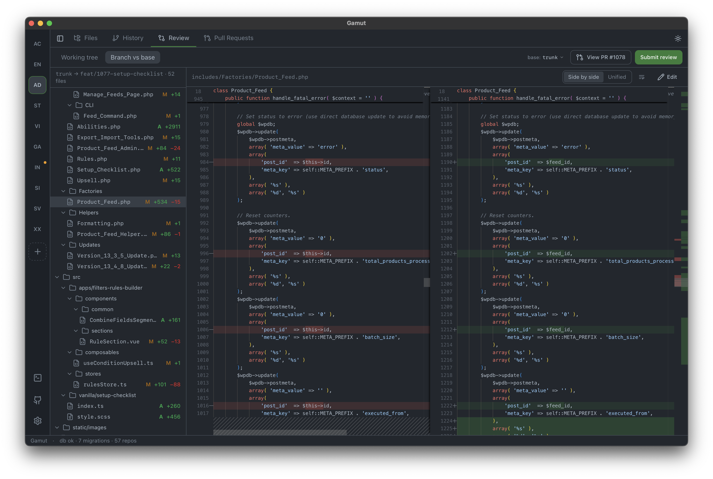
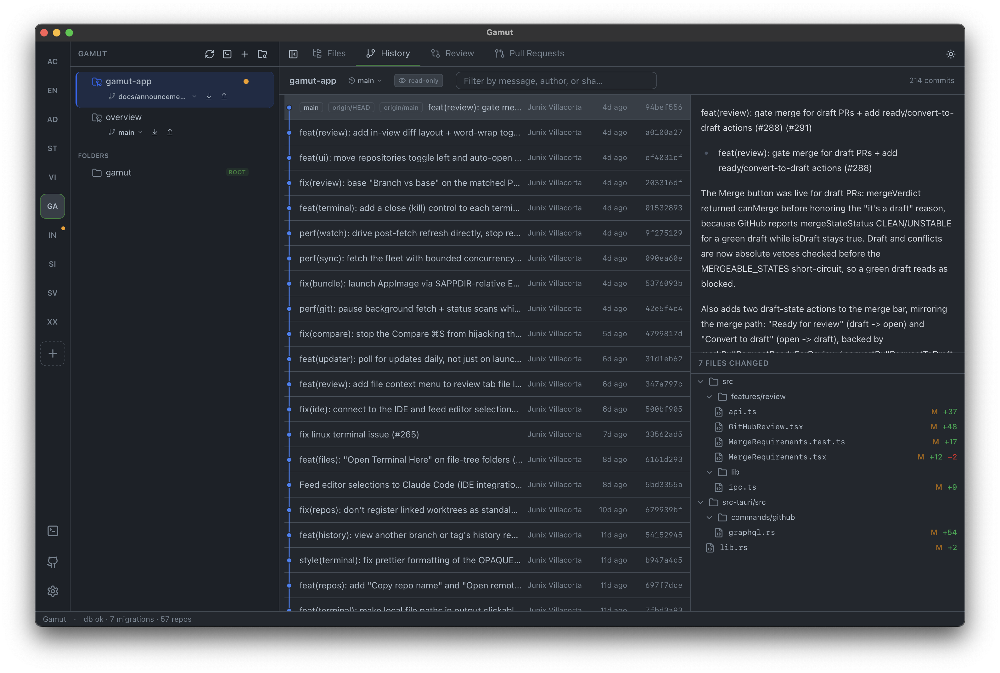

# Gamut

**A desktop app for reviewing code changes and exploring git history — built for the pace of AI-assisted development.**

[](https://github.com/Rymera-Web-Co/Gamut/releases)
[](https://github.com/Rymera-Web-Co/Gamut/releases/latest)
[](https://github.com/Rymera-Web-Co/Gamut/actions/workflows/ci.yml)
[](LICENSE)
[](https://github.com/Rymera-Web-Co/Gamut/releases/latest)

<!-- SCREENSHOT: hero — the Review tab showing a side-by-side diff of a branch
     vs base, with the file tree on the left and the repo sidebar visible.
     Save as docs/images/hero-review.png, then uncomment:
<p align="center">
  
</p>
-->

> The name **Gamut** carries a double meaning. In English, a *gamut* is the complete range of something — here, the whole span of your repositories, branches, and history in one place. In Cebuano, *gamut* means the "root of a tree" — a nod to digging through a repository's roots and history.

## Why Gamut?

Writing code used to be the slow part. Now that coding assistants produce a meaningful share of the changes in a codebase, the bottleneck has moved: the hard part is **reading** all that code — carefully, quickly, across many branches and repositories at once — before it ships.

Most git apps are built around *making* commits, with review bolted on. Gamut flips that. It was built at [Rymera](https://rymera.com.au) because our own review load outgrew the tools we had, and it puts the reviewing workflow first:

- **Review before you push.** See every uncommitted change, or your whole branch against its base, as clean side-by-side diffs — then stage and commit from the same screen (and comment inline when the branch has an open PR).
- **Review pull requests properly.** Read a GitHub PR's conversation and review threads in one place — and check the branch out to read its full diff in the Review tab; reply, approve, request changes, or merge without opening a browser.
- **Keep every repo in reach.** Register all your repositories once, organise them into groups, and jump between them — each with its own terminal, sync buttons, and history.

Everything runs locally on your machine — your code is read straight from disk. The only network traffic is git talking to your own remotes (including a background auto-fetch you can turn off in Settings), the GitHub API calls the app makes on your behalf, and a periodic check for app updates.

## What it does

| | Feature | In plain terms |
|---|---|---|
| 🔍 | **[Code review](docs/features/review.md)** | Check your own work before it goes out, and review teammates' (or your AI assistant's) pull requests — conversation, comments, approvals, and merging in one view, with one-click checkout to read the full diff locally. |
| 🕘 | **[History](docs/features/history.md)** | A visual map of every commit: who changed what, when, and why — with per-file diffs and line-by-line blame. |
| 📁 | **[Files](docs/features/files.md)** | Browse and edit any file in the repo with syntax highlighting, plus project-wide find & replace. |
| 🗂️ | **[Repositories](docs/features/repositories.md)** | Register repos by hand or auto-discover a whole folder of them; organise with groups and tags. |
| 🔄 | **[Sync](docs/features/sync.md)** | One-click fetch, pull, and push with live "ahead/behind" counts on every repo. |
| 🐙 | **[GitHub](docs/features/github.md)** | Connect your account securely (token stored in the OS keychain) to unlock the PR workflow. |
| ⌨️ | **[Terminal](docs/features/terminal.md)** | A built-in terminal with tabs and splits, opened right at any repo — long-running commands keep going in the background and ping you when they finish. |
| ⬆️ | **[Updates](docs/features/updates.md)** | The app checks for new versions on launch and installs them in place when you accept. |

<!-- SCREENSHOT: secondary — the History tab with the commit graph and a
     commit's file diffs open. Save as docs/images/history.png, then uncomment:
<p align="center">
  
</p>
-->

Full feature docs live in [`docs/`](docs/README.md), written so you don't need to be a git expert to follow them.

## Install

### macOS

**Homebrew (recommended):**

```bash
brew install --cask rymera-web-co/gamut/gamut
xattr -dr com.apple.quarantine /Applications/Gamut.app
```

Gamut isn't code-signed or notarized yet, so macOS quarantines the download — the second command clears that flag once, and the app opens normally from then on.

**Or manually:** download the `.dmg` from the [latest release](https://github.com/Rymera-Web-Co/Gamut/releases), drag **Gamut** to Applications, then run the same `xattr` command above.

<details>
<summary>More on the <code>xattr</code> step ("Gamut is damaged and can't be opened")</summary>

Because Gamut isn't yet signed with an Apple Developer ID or notarized, macOS Gatekeeper reports the quarantined app as *"damaged"* on first launch. It isn't — the `xattr` command clears the quarantine flag once. (`brew install` prints this command as a caveat too, and right-click → Open does **not** bypass this particular case on Apple Silicon.) A notarized build will remove this step — tracked in [#3](https://github.com/Rymera-Web-Co/Gamut/issues/3).

The install also taps [`Rymera-Web-Co/homebrew-gamut`](https://github.com/Rymera-Web-Co/homebrew-gamut), so afterwards you can refer to the cask as just `gamut` — upgrade later with `brew upgrade --cask gamut`. See [`homebrew/README.md`](homebrew/README.md) for how the tap is maintained.

</details>

### Windows

Download either installer from the [latest release](https://github.com/Rymera-Web-Co/Gamut/releases) — `Gamut_<version>_x64-setup.exe` (NSIS) or `Gamut_<version>_x64_en-US.msi` (MSI). Both install the same app.

Because the build isn't code-signed yet, SmartScreen shows *"Windows protected your PC"* — click **More info → Run anyway**, then follow the installer.

> Fetch / pull / push use the `git` command-line tool, so install [Git for Windows](https://git-scm.com/download/win) and make sure `git` is on your `PATH`. Browsing history and reviewing local changes work without it.

### Linux

Download the package for your distro from the [latest release](https://github.com/Rymera-Web-Co/Gamut/releases):

```bash
# AppImage (any distro — needs FUSE; on newer distros install libfuse2 if it won't launch)
chmod +x Gamut_<version>_amd64.AppImage && ./Gamut_<version>_amd64.AppImage

# Debian / Ubuntu
sudo apt install ./Gamut_<version>_amd64.deb

# Fedora / RHEL
sudo dnf install ./Gamut-<version>-1.x86_64.rpm
```

The `.deb`/`.rpm` packages pull in their dependencies (WebKitGTK 4.1, GTK 3) automatically. For the AppImage you may need WebKitGTK yourself — `libwebkit2gtk-4.1-0` on Debian/Ubuntu, `webkit2gtk4.1` on Fedora. As on Windows, install `git` from your package manager for fetch / pull / push.

### Nightly builds

Want the newest changes before they're released? Open **Settings → About** in the app and set **Update channel → Nightly**. Nightlies are automated, **unstable**, and unsigned on macOS — stay on **Stable** unless you want bleeding-edge. Details in [docs/features/updates.md](docs/features/updates.md).

## Keyboard-first

Everything important has a shortcut:

- `⌘/Ctrl+1…4` switch between Files · History · Review · Pull Requests
- `⌘/Ctrl+S` save the open file · `⌘/Ctrl+Enter` commit
- `⌘/Ctrl+B` toggle the repo sidebar · <code>⌘/Ctrl+&#96;</code> toggle the terminal · `⌘/Ctrl+J` toggle light/dark
- `⌘/Ctrl+⇧+P` pull · `⌘/Ctrl+⇧+K` push · `Ctrl+Tab` cycle repos

The full list is in [docs/keyboard-shortcuts.md](docs/keyboard-shortcuts.md).

## Under the hood

- **Backend:** Rust / [Tauri 2](https://v2.tauri.app) — owns all git operations, the GitHub API, persistence (SQLite via `rusqlite`), and secrets (OS keychain). The UI never touches a token or the filesystem directly.
- **Frontend:** React 19 + TypeScript + Vite, Tailwind v4 + shadcn/ui, TanStack Query, Zustand.

How it all fits together: [docs/ARCHITECTURE.md](docs/ARCHITECTURE.md).

## Develop

```bash
pnpm install
pnpm tauri dev      # launches the desktop app with hot reload
```

Other useful commands:

```bash
pnpm build          # typecheck + build the frontend
pnpm typecheck      # tsc --noEmit
cd src-tauri && cargo build   # compile the Rust backend
pnpm tauri build    # release bundle (.app/.dmg/.exe/.deb/…) under src-tauri/target/release/bundle/
```

The SQLite database is created in the platform app-data directory on first run (e.g. `~/Library/Application Support/com.rymera.gamut/gamut.db` on macOS).

## Contributing

Contributions are welcome — [CONTRIBUTING.md](CONTRIBUTING.md) covers environment setup, project layout, and conventions. For a tour of how the app is wired together, see [docs/ARCHITECTURE.md](docs/ARCHITECTURE.md), and the [documentation hub](docs/README.md) for per-feature docs.

## License

Licensed under the [Apache License, Version 2.0](LICENSE). © 2026 Rymera.
